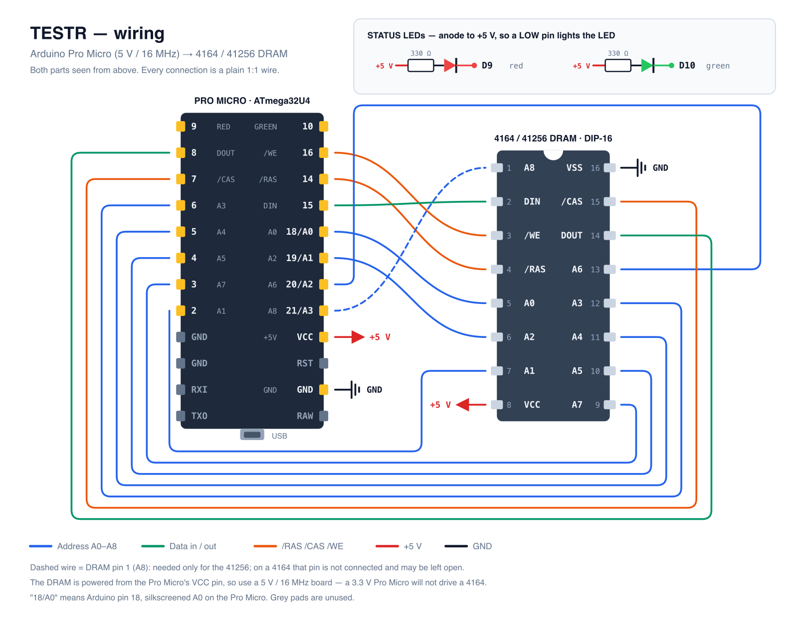

# TESTR

Simple and cheap 4164 DRAM tester.

TESTR turns an Arduino Pro Micro into a tester for the classic 16-pin dynamic RAM
chips found in home computers of the 8-bit era — the 64K×1 **4164** and its 256K×1
sibling **41256**. Apart from two status LEDs and their resistors, no extra parts
are needed: the DRAM is wired straight to the Pro Micro's I/O pins and powered from
its 5 V rail.

## Wiring



*(vector source: [`docs/wiring.svg`](docs/wiring.svg))*

| DRAM pin | Signal | Pro Micro pin | `#define` in [main.cpp](src/main.cpp) |
| --- | --- | --- | --- |
| 1  | A8 (41256 only) | 21 (`A3`) | `XA8` |
| 2  | DIN             | 15        | `DI`  |
| 3  | /WE             | 16        | `WE`  |
| 4  | /RAS            | 14        | `RAS` |
| 5  | A0              | 18 (`A0`) | `XA0` |
| 6  | A2              | 19 (`A1`) | `XA2` |
| 7  | A1              | 2         | `XA1` |
| 8  | VCC             | VCC (+5 V)| —     |
| 9  | A7              | 3         | `XA7` |
| 10 | A5              | 4         | `XA5` |
| 11 | A4              | 5         | `XA4` |
| 12 | A3              | 6         | `XA3` |
| 13 | A6              | 20 (`A2`) | `XA6` |
| 14 | DOUT            | 8         | `DO`  |
| 15 | /CAS            | 7         | `CAS` |
| 16 | VSS             | GND       | —     |

Pins 18–21 are the ones silkscreened `A0`–`A3` on the Pro Micro. On a 4164, pin 1
is not connected inside the chip, so the A8 wire can be left off — it only matters
for the 41256.

The two status LEDs hang between +5 V and an output pin, so a **LOW** pin lights them:

| LED | Pro Micro pin | `#define` |
| --- | --- | --- |
| red   | 9  | `R_LED` |
| green | 10 | `G_LED` |

`+5 V → 330 Ω → LED anode`, `LED cathode → pin`.

### Parts

* Arduino Pro Micro — must be the **5 V / 16 MHz** version, since the DRAM runs on 5 V
* a 16-pin DIP socket (a ZIF socket is nicer if you plan to test a whole box of chips)
* 1 red + 1 green LED, 2 × 330 Ω resistors
* breadboard and jumper wires

## Building and flashing

The project is a [PlatformIO](https://platformio.org/) project:

```sh
pio run -t upload          # build and flash
pio device monitor -b 9600 # watch the test
```

The `micro` board in [platformio.ini](platformio.ini) targets the ATmega32U4 at
5 V / 16 MHz, which is what a Pro Micro clone is. If you use a genuine SparkFun
board you can equally set `board = sparkfun_promicro16`.

## Running a test

Insert the chip, then open the serial monitor at **9600 baud**. The Pro Micro talks
over native USB and the sketch waits for the port to be opened (`while (!Serial)`),
so nothing happens until a terminal is attached.

```
4164 - 41256 DRAM TESTER
Licensed under GPL v3.0
CHIP IS 64K x 1
....
CHIP TESTED OK!
```

A `.` is printed before each of the four passes. What the LEDs tell you:

| LEDs | Meaning |
| --- | --- |
| green flickering | a pass is running (it toggles once per column) |
| both on for a second | a pass finished |
| green on, red off | all four passes passed — `CHIP TESTED OK!` |
| red on, green off | the chip failed — see the address in the serial log |

On failure the sketch stops and prints the offending address, for example:

```
CHIP FAILED TEST $1A2F
```

The value is `(column << bus_size) + row` in hex.

## How the test works

After configuring the pins, `setup()` runs 512 RAS-only cycles to refresh the array,
then `loop()` walks the whole chip four times:

1. `fillx(0)` — alternating `0/1` pattern, verified cell by cell
2. `fillx(1)` — the inverse alternating pattern
3. `fill(0)` — all zeroes
4. `fill(1)` — all ones

Every cell is written and read back immediately, so both stuck bits and address
decoding faults show up. Interrupts are disabled during a pass so the tight
RAS/CAS timing is not disturbed; they are re-enabled only to print to the serial
port. Once a verdict is reached the sketch halts in an endless loop, so press the
Pro Micro's reset button to test the next chip.

## Testing a 41256

The sketch is currently hard-wired to 64K mode. The original design read a jumper on
pin 10 to pick the chip type, but that input is commented out and replaced by a
constant in `setup()`:

```cpp
//if (digitalRead(M_TYPE)) {
if (false) {
  /* jumper not set - 41256 */
  bus_size = BUS_SIZE;
```

Change `if (false)` to `if (true)` and reflash to test a 41256 — and make sure the A8
wire to DRAM pin 1 is in place, because a 256K×1 chip needs all nine address lines.

## Credits and licence

Based on the DRAM tester by **iss (2020)**, published in the
[Defence Force forum](https://forum.defence-force.org/viewtopic.php?f=9&t=1699),
adapted here for the Arduino Pro Micro and PlatformIO.

Licensed under the **GNU General Public License v3.0** or later — see the header of
[src/main.cpp](src/main.cpp).
